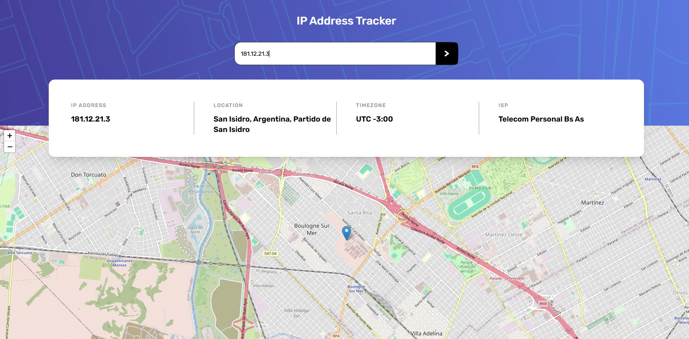

# Frontend Mentor - IP address tracker solution

This is a solution to the [IP address tracker challenge on Frontend Mentor](https://www.frontendmentor.io/challenges/ip-address-tracker-I8-0yYAH0). Frontend Mentor challenges help you improve your coding skills by building realistic projects. 

## Table of contents

- [Overview](#overview)
  - [The challenge](#the-challenge)
  - [Screenshot](#screenshot)
  - [Links](#links)
- [My process](#my-process)
  - [Built with](#built-with)
  - [What I learned](#what-i-learned)
  - [Continued development](#continued-development)
- [Author](#author)

**Note: Delete this note and update the table of contents based on what sections you keep.**

## Overview

### The challenge

Users should be able to:

- View the optimal layout for each page depending on their device's screen size
- See hover states for all interactive elements on the page
- See their own IP address on the map on the initial page load
- Search for any IP addresses or domains and see the key information and location

### Screenshot

### Links

- Solution URL: [https://github.com/DiegoQR/ip-address-tracker.git](https://github.com/DiegoQR/ip-address-tracker.git)
- Live Site URL: [https://ip-address-tracket.netlify.app](https://ip-address-tracket.netlify.app)

## My process

### Built with

- Semantic HTML5 markup
- CSS custom properties
- Flexbox
- CSS Grid
- Mobile-first workflow
- Typescript
- [React](https://reactjs.org/) - JS library
- [Tailwind](https://tailwindcss.com) - For styles

### What I learned

This was a very fun project to work on because of the use of an API and because it was my first project trying to learn Typescript, learned about what value brings TS at the time on writing maintainable code and how the declaration of types and interfaces can help me to make a readable code. Also had to use the fetch API to retrieve the data to the user and with that handle the HTTP codes, the payload and the data. In the end i ended up using another API for geolocation due to the limit of request in the other one. Because this renews his request by 1000 every month while the other API only has 1000 request forever.
### Continued development

As said in this project i dealt with the types problem in TS, as to decide the type of each variable and to respect the contract of the types. I want to learn more about typescript and how to deal with this type of challenges when working with React.

## Author

- Website - [Diego QR](https://diegoqr-portfolio.dev)
- Frontend Mentor - [@DiegoQR](https://www.frontendmentor.io/profile/DiegoQR)
- LinkedIn - [Diego Alejandro Quiñones Rudon](https://www.linkedin.com/in/diego-alejandro-quinones-rudon)

